<!---->

[](https://github.com/xiaoweiChen/Building-Programming-Language-Interpreters)

[](https://github.com/xiaoweiChen/Hands-On-Design-Patterns-with-Cpp)

[](https://github.com/xiaoweiChen/Cpp-Memory-Management)

[](https://github.com/xiaoweiChen/Debunking-Cpp-Myths)

[](https://github.com/xiaoweiChen/Refactoring-with-Cpp)

[](https://github.com/xiaoweiChen/100-Cpp-Mistakes-and-How-to-Avoid-Them)

[](https://github.com/xiaoweiChen/Performance-Analysis-and-Tuning-on-Modern-CPUS-2ed)

[](https://github.com/xiaoweiChen/Asynchronous-Programming-with-Cpp)

[](https://github.com/xiaoweiChen/Modern-CMake-for-Cpp-2ed)

[](https://github.com/xiaoweiChen/Clang-Compiler-Frontend)

[](https://github.com/xiaoweiChen/Professional-cpp-6ed)

[](https://github.com/xiaoweiChen/Learn-LLVM-17)

[](https://github.com/xiaoweiChen/Template-Metaprogramming-with-CPP)

[](https://github.com/xiaoweiChen/CPP-20-STL-Cookbook)

[](https://github.com/xiaoweiChen/Modern-CMake-for-Cpp)

[](https://github.com/xiaoweiChen/CMake-Best-Practices)

[](https://github.com/xiaoweiChen/Cpp-Templates-2nd)

[](https://github.com/xiaoweiChen/The-Art-of-Writing-Efficient-Programs)

[](https://github.com/xiaoweiChen/LLVM-Techniques-Tips-and-Best-Practies)

[](https://github.com/xiaoweiChen/CPP-17-STL-cookbook)

[](https://github.com/xiaoweiChen/CMake-Cookbook)

[](https://github.com/xiaoweiChen/CPP-Concurrency-In-Action-2ed-2019)

[](https://github.com/xiaoweiChen/Heterogeneous-Computing-with-OpenCL-2.0)

[](https://github.com/xiaoweiChen/Cpp_Concurrency_In_Action)

from: https://github.com/anuraghazra/github-readme-stats
<!--
**xiaoweiChen/xiaoweiChen** is a ✨ _special_ ✨ repository because its `README.md` (this file) appears on your GitHub profile.

Here are some ideas to get you started:

- 🔭 I’m currently working on ...
- 🌱 I’m currently learning ...
- 👯 I’m looking to collaborate on ...
- 🤔 I’m looking for help with ...
- 💬 Ask me about ...
- 📫 How to reach me: ...
- 😄 Pronouns: ...
- ⚡ Fun fact: ...
-->
